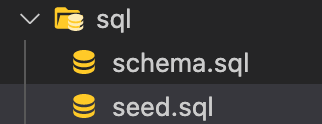

# Employee Tracker

GitHub Repository Link: https://github.com/WitnessMyHands/Employee-Tracker

[YouTube Video Link](https://www.youtube.com/watch?v=dtFKt8IqDTY)

## Table of Contents

- [Information](#Information)
- [Usage](#Usage)
- [Questions](#Questions)

## Information

The idea behind this Employee Tracker is develop a 'Command-Line Application' that allows Employers to ADD, REMOVE, UPDATE and overall Manage the Departments, Roles and Employees in the company.

Using Node, Inquirer and MySQL, the user is able to call and retrieve information from the created database.

The application features:
* Node.js
* Inquirer
* MySQL

In order to run the Application successfully, please follow the Instruction found under '[Usage](#Usage)'.
  
## Usage

To run this application correctly follow these instructions:

* Install and run MySQL WorkBench (or similar software) to establish a MySQL Database and perform Queries. 

From the Terminal:

* First, set your package.json file. This can be done by using ' npm init -y '
* Install your MySQL Package with ' npm i mysql '
* Run Inquirer by prompting ' npm i inquirer '
* You will also like to set up your Console Table by typing ' npm install console.table --save '

Within your coding software, such as VS Code:

* Create a ' .js ' file such as ' server.js ' to utilize

For organization purposes, individual folders for the SQL files can be saved as such:

## Questions
*Please contact WitnessMyHands via GitHub with any questions or concerns.*

- https://github.com/WitnessMyHands